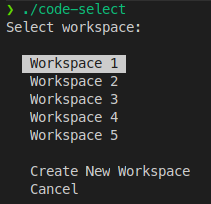
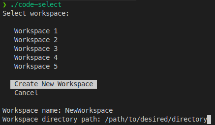

# vscode-selector

Command line workspace selector for VSCode enabling quick access to open any predefined vscode workspace

# Usage

By default `code-select` search for any files ending in `.code-workspace` which are located at `$HOME/vscode-workspaces`. The search directory can be changed by modifying the `$VSCODE_WORKSPACES_PATH` environment variable to be the location of the desired directory.

`code-select` will show all options defined by the filename that the workspace is saved under. Select the desired workspace with the arrow keys and press enter to open that workspace.

A new basic workspace can be created with the "Create New Workspace" option. This option takes the filename to assign to the workspace followed by the path that the workspace should lead to. The new workspace file is saved in `$VSCODE_WORKSPACES_PATH` as described above.

Note: Contents of workspace files are not directly handled and are simply passed to the `code` command so all config parsing is handled by VSCode.

Add `code-select` to `$PATH` or create a symlink in either `/bin` or `/usr/bin` to use in any terminal e.g. `ln -s $(pwd)/code-select /usr/bin/code-select`.

# Future extensions

- Command line "search" argument to only list workspaces with some match/substring to argument
